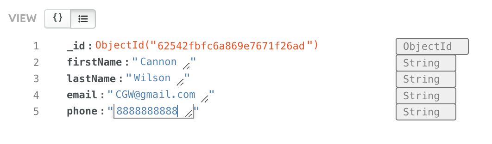

# Instructions  

---

Create a new database 
called `test_db` in your cluster. Inside that database,
make a new collection named `users` that you will
use for this lesson.

Edit 'index.js' so that the post request made by
the form in the HTML document gets converted into
a new document in your database. If you get lost,
remember that you can get more info by
clicking 'Connect' on your cluster in
MongoDB Atlas and then
selecting 'Connect your appplication'.

The documents you insert into your database should
follow this format with `firstName`, `lastName`, 
`email`, and `phone` as fields:
